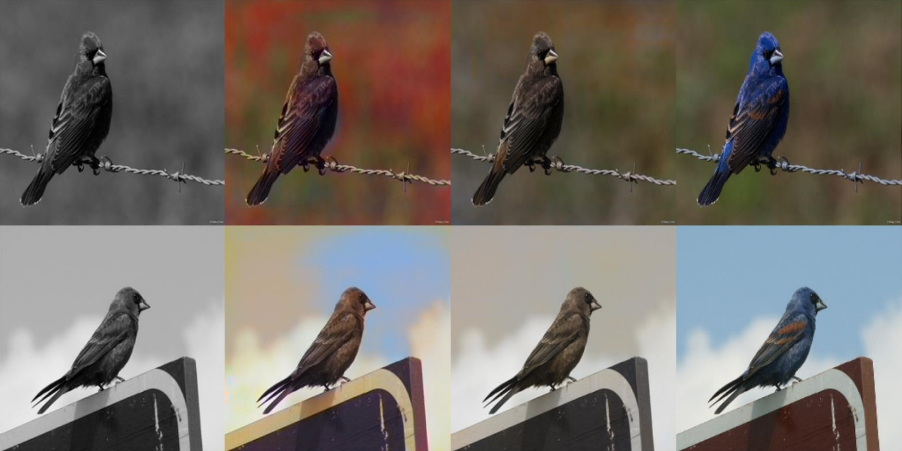
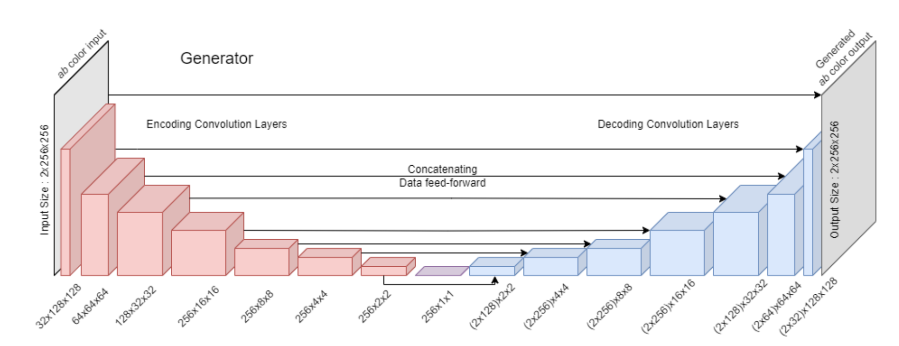
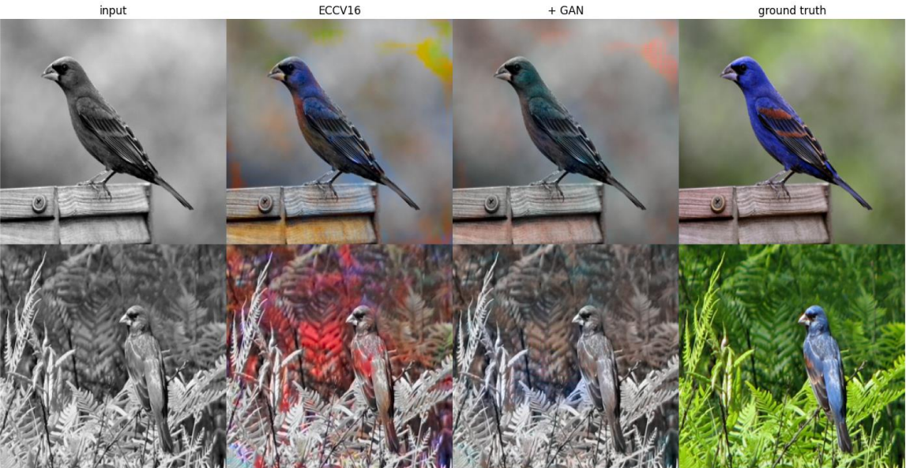

<!--  -->

 

*Recall :: School Project*  
*Deep Learning* | *Spring 2024* | *Final Project* | *Dr. Hongkai Yu*

## TL;DR
- Topic: Recoloring grayscale images of birds.
- Method: Custom GAN on small available samples, thousands of iterations.
- Project timeline: 1 week
- Lines of code: 1000+
- Results: 
    - Successful slight recolor of identified birds in ideal circumstances.
    - Difficulties in GAN training due to small data size.
    - Learned a lot, but did not provide substantial results at the time.

## Links
<a href="/ASUKENNYK_FINAL.pdf" target="_blank">Paper</a>

<a href="https://github.com/drert/CIS694-DL/tree/main/Project" target="_blank">Source Code (GitHub)</a>

## Preface

The class for which this project was made was a particularly challenging Deep Learning course. It really tested the limits of myself and my peers, and was very impactful in the way I looked at ML/DS/AI. In case he ever stumbles across this post, thank you, Dr. Yu! This class was amazing.

The topic was very loose for this assignment, permitting us to choose any problem we were interested in and propose a deep-learning-based solution to it. I had a number of topics that I attempted to work on, but this one was a last-minute swap due to difficulties obtaining sufficient datasets for my other ideas.

As such, this project took 1 week of serious crunch work. 

## Background

Many researchers, including Dr. Yu, are interested in automatic recoloring of old grayscale images. Most of this work is focused on old photos holding sentimental or historical value. In my case, most training datasets didn't have public availability. 

The ones that did had a request system, of which none replied to my messages requesting them for educational purposes. These databases consisted of gray images professionally remastered in color with the best efforts of historical artists. I understand why they might not just hand them out to anyone. 

The approach I used instead was simply using a database I had downloaded already, and graying the images myself. This could have been done with images of people, but I thought I'd be creative and chose animals in nature instead. After all, a lot of gray trail cam footage exists which may also be recolored! 

I had the CUB_200_2011 dataset available, which contains small sample sizes of classified birds. The small size creates a challenge, where I do not have a lot of information to feed into a learning model. I had hoped that this would emulate the possible restrictions of datasets of historical images. 

## Method

The library of choice for this project was PyTorch, starting with their DCGAN (Deep Convolutional Generative Adversarial Network) <a href="https://docs.pytorch.org/tutorials/beginner/dcgan_faces_tutorial.html" target="_blank">tutorial</a>. Almost no part of their base code was recognizable by the time I had completed it, but I am linking it here for anyone who might want a starting point to try this.

It is important to remember that the focus here is recoloring, not generation from scratch. For our inputs, we split each image into 2 slices: A lightness slice and an ab color slice. The lightness slice is our model's generator input, while the color slice is the ground truth. This feature is the reason why finding training data for this kind of project is necessarily easy, as any dataset with a sufficiently large number of images can be recolored. 

The generator and discriminator in were both created loosely following a method called Pix2Pix--another <a href="https://www.tensorflow.org/tutorials/generative/pix2pix" target="_blank">tutorial</a> here. Pix2Pix is a transforming model, suitable for our purposes given that we have our grayscale "framework" to work with. The discriminator is mostly kept standard, but to achieve any result, a feed-forward network was necessary in the generator. It's final architecture is shown below.

<!--  -->

The feed-forward network solves a lot of issues. To color the birds correctly, the model first needs to find them. One might argue that multiple models would be more effective for this purpose, and this is discussed in the final section below. 

The detection is achieved, I hope, during the encoding layers. I am still not certain as to how I would test this to confirm, but it was not even a thought at the time of making this model. This is one of the things I'm currently working on regarding my newer models, figuring out how to identify the effectiveness of each layer.

Once encoding is complete, the decoding begins, appending old data from the previous encoding steps. This permits the model to introduce color while still respecting the original shape provided, rather than simply painting blotches and hoping. This effect can be confirmed by observing the lack of convergence when training without feed-forward. Using this kind of data appending configuration in neural networks has proven to be a great boon from others' research.

## Results

<!--  -->

Alongside my method, the dataset was tested with a model from a paper named *Colorful Image Colorization* [EECV16]. These are used for comparison to see where failures occur, and where certain models may perform better. 

Due to the nature of the data (small sets with large variety), it was difficult to consistently obtain good results. The training required several hundred passes over shifted versions of the training images, and ultimately the colors in my model were usually just slightly off the mark.

It can be seen in the image above that both my model and the EECV16 model perform acceptably when the input images are non-noisy. When the grayscale input is noisy, such as in the bottom examples with many leaves surrounding the bird, both models seem to struggle. This indicates that it is fundamentally challenging for these models to identify where the birds are given surroundings that are complex. 

In many ways, this model was successful. Provided that the object is located and identified correctly, the model is able to hallucinate color options that are not only nice looking, but correct! For a sprint-paced project with little planning, I am proud of how far I managed to get. 

## Hindsight // Afterword
This project taught me a lot. Ultimately, the most important thing to take away is the importance of finding a good dataset early into planning! I still intend on one day going back to my human pose detection plan, but the difficulties in securing an effective dataset really make this particular assignment stressful.

Rather than mull about what-could-have-beens, I'd like to make a habit here for future project posts by introducing 2 lists: What was learned (Lessons), and what could be worked on in the future or done better (Improvements).

### Lessons:
<ol>
<li> It is incredibly important to *size* your bites.</li>

* This problem is hard to dissect, it really comes down to several problems in one: Identifying, Locating, and then Recoloring.

* I didn't have great examples of images with multiple birds, but I am certain that the model would fail given that the training dataset didn't incorporate this.

<li> GAN balancing is exponentially more challenging as the problem becomes more complex. </li>

* It's hard to say, but when seeing that the colors are still slightly off in good examples, I estimate that my discriminator was insufficient for the problem presented.
* It's important to "upgrade" the generator and discriminator together, and give each sufficient strength to control the other.

<li> Even when you understand the code, the model as a whole won't always act as you intend or plan. </li>

* Building these models often feels like making a lego RC car as a kid. In principle, you have built the framework and it works -- but this doesn't mean that you understand what's happening in the controller, the motor, the circuitry.
* In this way, it seems clear that the knowns, such as data pre-processing, are very important to have an iron grip on. By poorly defining my problem to begin with, I crippled my model's chances at success.
</ol>

### Improvements:

</ol>
<ol>
<li> There is, most likely, a multi-model or joint model solution here that I did not consider at the time. </li>

* Rather than hoping that a generator would be able to do all of the problems, I'd like to make a multimodel approach that uses different techniques to ID, label, and trace the objects in the image.
* Consider a model trained to identify objects of interest, which feeds its output into the generator alongside the grayscale image. This could improve the process innately by unloading responsibilities from the generator.
    
<li> I'd love to have taken the time to do deep analysis, visualizing the trained model layers to see what's going on under the hood. </li> 

* Is the model casting a wide net to identify clusters where the bird may be? 
* Is this done in the encoding stage as I had hoped?
* Is the discriminator able to identify where the bird is just like the generator?
* Many other questions persist.

</ol>

Thanks for reading!